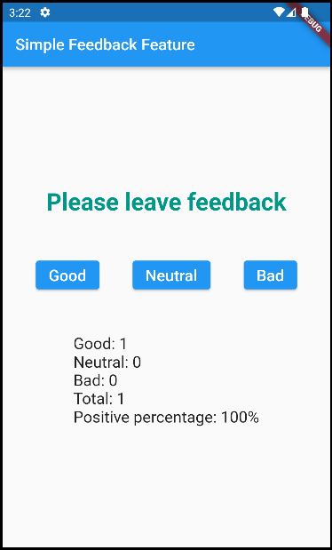

# Simple Feedback Feature

## Getting Started

Application inludes 3 simple widgets, which are used to show feedback.

- **Feedback Options** - This widget shows 3 buttons, that are gotten from object which contains 3 states - good, neutral, bad.
- **Statistics** - This widget shows general information about the feedback.
- **Notification** - This widget recieves message that will be shown if there is no feedback
